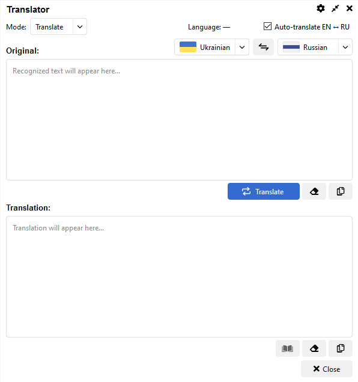

# WhisperBridge


### [DOWNLOAD](https://github.com/catgirl3d/WhisperBridge/releases) | [README Українською](README.UA.md)

 

Desktop application for instant on-screen text translation. Use it as a powerful OCR tool to capture and translate any screen region, or as a standard translator with a dedicated window.

## Features

- **Screen region capture + OCR** - Uses LLM-based OCR (OpenAI/Google) for high-accuracy text recognition
- **Fast translation via AI** - Almost instant translation using OpenAI, Google Gemini, or DeepL
- **Text Stylist** - Rewrite text in different styles (Formal, Friendly, Simplify, etc.)
- **Translator Window** - Convenient copy, paste, and quick actions
- **Global hotkeys** - Configurable shortcuts for capture, translation, and activation
- **System tray** - Tray icon and Settings window (Qt / PySide6)

## Quick Start

**Requirements:** Python 3.8+ (Windows/macOS/Linux)

### Setup

```bash
# Create virtual environment
python -m venv .venv

# Activate virtual environment
# Windows
.venv\Scripts\activate

# macOS/Linux
source .venv/bin/activate

# Install dependencies
pip install -r requirements.txt
```

```
Install dependencies (recommended for development)
pip install -e .[qt,dev]

Notes:
- The project declares optional extras in pyproject.toml; use the `qt` extra to install PySide6 and UI dependencies, and `dev` for developer tooling.
- For a minimal runtime-only install you can still use: `pip install -r requirements.txt`, but the editable install with extras is recommended during development.
```

### Run
 
```bash
# Run application with Qt UI
python src/main.py
```

Packaging and console script

Development:
python src/main.py

## Configuration

### Settings Location

- **Windows:** `%USERPROFILE%\.whisperbridge\`
- **macOS/Linux:** `~/.whisperbridge/`

### API Key Setup

1. Open the Settings dialog in the application
2. Provide your API keys (OpenAI, Google Gemini, and/or DeepL)
3. Keys will be stored securely via keyring

### Additional Settings

In the Settings window you can configure:
- **AI Providers**: Choose between OpenAI, Google, or DeepL.
- **Models**: Select specific models for translation and vision tasks.
- **Text Stylist**: Customize presets for text rewriting.
- **Hotkeys**: Remap global shortcuts.
- **Appearance**: Switch between Light, Dark, or System themes.

### LLM-based OCR configuration

The app uses LLM-based OCR for superior accuracy. Configuration keys:
- `ocr_llm_prompt`: custom prompt for the vision model.
- `openai_vision_model`: model name for OpenAI vision requests (default: "gpt-4o-mini")
- `google_vision_model`: model name for Google vision requests (default: "gemini-2.5-flash")

Flow: Capture → LLM OCR (image encoded & resized) → extract text → translate.

## Project Structure

### Key Files

| File | Description |
|------|-------------|
| `src/main.py` | Application entry point |
| `src/whisperbridge/core/config.py` | Settings and configuration model |
| `src/whisperbridge/ui_qt/app.py` | Qt application and initialization |
| `requirements.txt` | Python dependencies list |
| `pyproject.toml` | Project configuration |

### Architecture

Project structure (high level)

```text
WhisperBridge/
├── docs/              # documentation and guidelines
├── src/
│   └── whisperbridge/
│       ├── core/      # core logic: config, API manager, settings
│       ├── services/  # business services: OCR, translation, hotkeys
│       ├── providers/ # provider adapters: OpenAI, Google, DeepL
│       ├── ui_qt/     # Qt UI: app, windows, workers
│       ├── utils/     # stateless utilities: image, screen, language
│       └── models/    # pydantic models
├── tests/             # unit and integration tests
├── pyproject.toml
└── requirements.txt
```

Testing

Tests are in the `tests/` directory. Run the test suite with:
pytest tests/

For coverage:
pytest --cov=whisperbridge tests/

## Usage

1. **Launch application** - start WhisperBridge, icon will appear in system tray
2. **Configure API** - set up your API keys (OpenAI, Google, or DeepL) through Settings window
3. **Translate via OCR** - press `Ctrl+Shift+T`, select a screen region, and get an instant translation in the window.
4. **Quick Translate** - press `Ctrl+Shift+J` to copy selected text and translate it immediately.
5. **Standard Translation** - press `Ctrl+Shift+Q` to open the translator window, where you can type or paste text for manual translation.

### Default Hotkeys

- **Ctrl+Shift+T**: Capture region and translate via OCR
- **Ctrl+Shift+Q**: Open translator window
- **Ctrl+Shift+J**: Quick Translate (Copy selected text and translate)

## Technical Details

- **OCR Engine:** LLM-based Vision (OpenAI/Google) for text recognition
- **Translation API:** OpenAI, Google Gemini, DeepL
- **UI Framework:** Qt/PySide6 for cross-platform interface
- **Security:** Keyring for secure API key storage

## Supported Platforms

- Windows 10/11
- macOS 10.15+