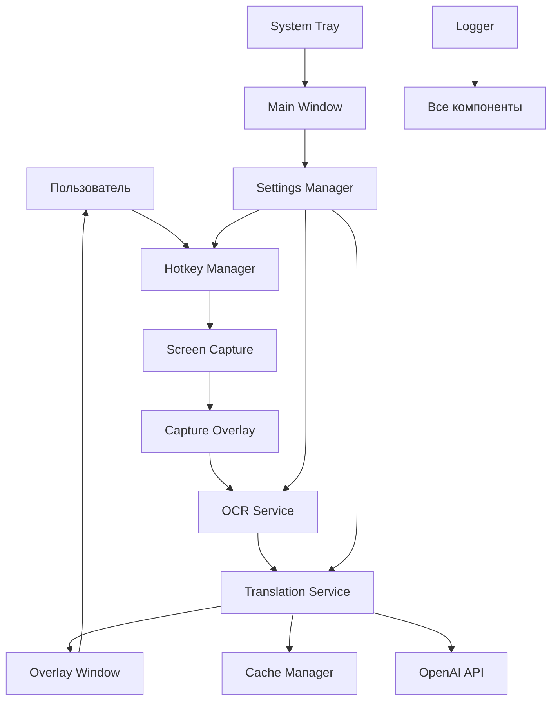
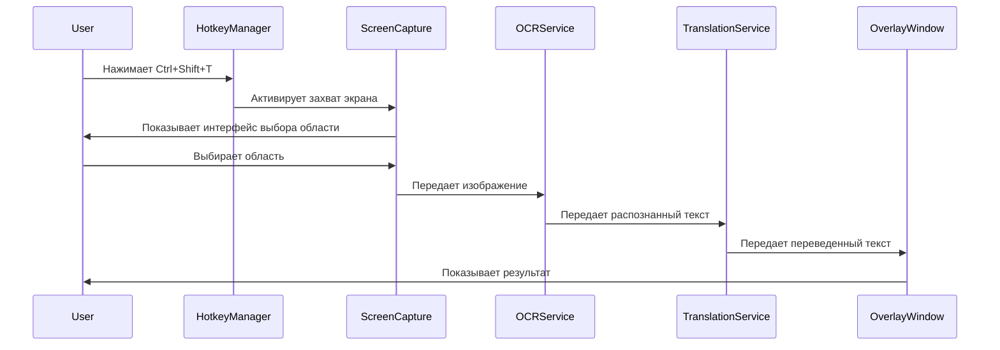

# WhisperBridge - Архитектура проекта

## Обзор проекта

WhisperBridge - это десктопное приложение для быстрого перевода текста в мессенджерах с использованием OCR и GPT API. Приложение активируется глобальными горячими клавишами, захватывает области экрана, распознает текст и предоставляет переводы через оверлей-интерфейс.

## Функциональные требования

### Основные функции
1. **Глобальные горячие клавиши** - активация по Ctrl+Shift+T
2. **Захват области экрана** - интерактивный выбор области для OCR
3. **OCR распознавание** - извлечение текста из изображений
4. **GPT интеграция** - перевод текста через API
5. **Оверлей-интерфейс** - отображение результатов поверх других окон
6. **Системный трей** - фоновая работа приложения
7. **Настройки** - конфигурация языков, промптов, API ключей
8. **Копирование и автовставка** - быстрые действия с результатами

### Нефункциональные требования
- **Производительность**: быстрый отклик (< 3 сек для перевода)
- **Удобство**: минимальное количество кликов
- **Надежность**: обработка ошибок API и OCR
- **Безопасность**: защищенное хранение API ключей
- **Кроссплатформенность**: Windows, macOS, Linux

## Архитектура системы

### Основные компоненты

```
┌─────────────────────────────────────────────────────────────┐
│                    WhisperBridge                            │
├─────────────────────────────────────────────────────────────┤
│  UI Layer (CustomTkinter)                                  │
│  ├── Main Window (Settings)                                │
│  ├── Overlay Window (Results)                              │
│  ├── System Tray                                           │
│  └── Screen Capture Interface                              │
├─────────────────────────────────────────────────────────────┤
│  Core Services                                             │
│  ├── Hotkey Manager                                        │
│  ├── Screen Capture Service                                │
│  ├── OCR Service                                           │
│  ├── Translation Service (GPT)                             │
│  └── Settings Manager                                      │
├─────────────────────────────────────────────────────────────┤
│  Data Layer                                                │
│  ├── Configuration Storage                                 │
│  ├── Cache Manager                                         │
│  └── Logging System                                        │
├─────────────────────────────────────────────────────────────┤
│  External APIs                                             │
│  ├── OpenAI GPT API                                        │
│  └── OCR Engine (EasyOCR/PaddleOCR)                       │
└─────────────────────────────────────────────────────────────┘
```

## Структура проекта

```
WhisperBridge/
├── src/
│   ├── __init__.py
│   ├── main.py                     # Точка входа приложения
│   ├── app.py                      # Основной класс приложения
│   │
│   ├── ui/                         # Пользовательский интерфейс
│   │   ├── __init__.py
│   │   ├── main_window.py          # Главное окно настроек
│   │   ├── overlay_window.py       # Оверлей с результатами
│   │   ├── capture_overlay.py      # Интерфейс захвата экрана
│   │   ├── system_tray.py          # Системный трей
│   │   └── components/             # UI компоненты
│   │       ├── __init__.py
│   │       ├── settings_panel.py
│   │       ├── result_display.py
│   │       └── capture_selector.py
│   │
│   ├── services/                   # Основные сервисы
│   │   ├── __init__.py
│   │   ├── hotkey_manager.py       # Управление горячими клавишами
│   │   ├── screen_capture.py       # Захват экрана
│   │   ├── ocr_service.py          # OCR распознавание
│   │   ├── translation_service.py  # Сервис перевода
│   │   └── settings_manager.py     # Управление настройками
│   │
│   ├── core/                       # Базовые классы и утилиты
│   │   ├── __init__.py
│   │   ├── config.py               # Конфигурация приложения
│   │   ├── exceptions.py           # Пользовательские исключения
│   │   ├── logger.py               # Система логирования
│   │   ├── cache.py                # Кэширование
│   │   └── utils.py                # Вспомогательные функции
│   │
│   └── models/                     # Модели данных
│       ├── __init__.py
│       ├── settings.py             # Модель настроек
│       ├── translation.py          # Модель перевода
│       └── capture.py              # Модель захвата
│
├── assets/                         # Ресурсы приложения
│   ├── icons/                      # Иконки
│   ├── sounds/                     # Звуки уведомлений
│   └── themes/                     # Темы интерфейса
│
├── config/                         # Конфигурационные файлы
│   ├── default_settings.json       # Настройки по умолчанию
│   ├── prompts.json               # Промпты для GPT
│   └── languages.json             # Поддерживаемые языки
│
├── tests/                          # Тесты
│   ├── __init__.py
│   ├── test_services/
│   ├── test_ui/
│   └── test_core/
│
├── docs/                           # Документация
│   ├── API.md
│   ├── INSTALLATION.md
│   └── USER_GUIDE.md
│
├── requirements.txt                # Python зависимости
├── setup.py                       # Установочный скрипт
├── README.md                       # Описание проекта
└── .env.example                   # Пример переменных окружения
```

## Технологический стек

### Основные библиотеки

#### UI Framework
- **CustomTkinter** - современный UI для Python
  - Причина выбора: нативный вид, хорошая производительность
  - Альтернативы: PyQt6, Kivy

#### Системная интеграция
- **pynput** - глобальные горячие клавиши и управление мышью
- **pystray** - системный трей
- **pillow (PIL)** - работа с изображениями

#### Захват экрана
- **mss** - быстрый захват экрана
  - Причина: высокая производительность, кроссплатформенность
  - Альтернатива: pyautogui

#### OCR
- **EasyOCR** - основной OCR движок
  - Причина: хорошее качество, поддержка множества языков
  - Fallback: **PaddleOCR**

#### API интеграция
- **openai** - официальный клиент OpenAI API
- **httpx** - асинхронные HTTP запросы
- **tenacity** - retry механизм для API вызовов

#### Конфигурация и данные
- **pydantic** - валидация настроек
- **keyring** - безопасное хранение API ключей
- **appdirs** - определение путей конфигурации

#### Утилиты
- **loguru** - продвинутое логирование
- **click** - CLI интерфейс (для отладки)

### Полный список зависимостей

```python
# requirements.txt
customtkinter>=5.2.0
pynput>=1.7.6
pystray>=0.19.4
pillow>=10.0.0
mss>=9.0.1
easyocr>=1.7.0
openai>=1.3.0
httpx>=0.25.0
tenacity>=8.2.0
pydantic>=2.4.0
keyring>=24.2.0
appdirs>=1.4.4
loguru>=0.7.2
click>=8.1.7
```

## Детальная архитектура модулей

### 1. Application Core (app.py)

```python
class WhisperBridgeApp:
    """Основной класс приложения"""
    
    def __init__(self):
        self.settings_manager = SettingsManager()
        self.hotkey_manager = HotkeyManager()
        self.screen_capture = ScreenCaptureService()
        self.ocr_service = OCRService()
        self.translation_service = TranslationService()
        
    def initialize(self):
        """Инициализация всех компонентов"""
        
    def run(self):
        """Запуск приложения"""
        
    def shutdown(self):
        """Корректное завершение работы"""
```

### 2. Hotkey Manager

```python
class HotkeyManager:
    """Управление глобальными горячими клавишами"""
    
    def register_hotkey(self, combination: str, callback: callable):
        """Регистрация горячей клавиши"""
        
    def unregister_all(self):
        """Отмена всех горячих клавиш"""
        
    def on_translate_hotkey(self):
        """Обработчик основной горячей клавиши"""
```

### 3. Screen Capture Service

```python
class ScreenCaptureService:
    """Сервис захвата экрана"""
    
    def start_area_selection(self) -> Rectangle:
        """Запуск интерактивного выбора области"""
        
    def capture_area(self, area: Rectangle) -> Image:
        """Захват указанной области экрана"""
        
    def capture_full_screen(self) -> Image:
        """Захват всего экрана"""
```

### 4. OCR Service

```python
class OCRService:
    """Сервис распознавания текста"""
    
    def __init__(self):
        self.primary_engine = EasyOCR()
        self.fallback_engine = PaddleOCR()
        
    def extract_text(self, image: Image, language: str) -> str:
        """Извлечение текста из изображения"""
        
    def detect_language(self, image: Image) -> str:
        """Автоопределение языка текста"""
```

### 5. Translation Service

```python
class TranslationService:
    """Сервис перевода через GPT API"""
    
    def __init__(self):
        self.client = OpenAI()
        self.cache = TranslationCache()
        
    async def translate(self, text: str, source_lang: str, target_lang: str) -> str:
        """Перевод текста"""
        
    def build_prompt(self, text: str, source_lang: str, target_lang: str) -> str:
        """Построение промпта для GPT"""
```

## Диаграмма взаимодействия компонентов



## Последовательность работы

### Основной сценарий использования



## Конфигурация и настройки

### Структура настроек

```json
{
  "general": {
    "language": "ru",
    "theme": "dark",
    "startup_with_system": true,
    "show_notifications": true
  },
  "hotkeys": {
    "translate": "ctrl+shift+t",
    "quick_translate": "ctrl+shift+q"
  },
  "ocr": {
    "primary_engine": "easyocr",
    "fallback_engine": "paddleocr",
    "languages": ["en", "ru", "uk"],
    "confidence_threshold": 0.7
  },
  "translation": {
    "api_provider": "openai",
    "model": "gpt-3.5-turbo",
    "source_language": "auto",
    "target_language": "ru",
    "custom_prompts": {
      "default": "Translate the following text to {target_language}:",
      "formal": "Translate formally to {target_language}:",
      "casual": "Translate casually to {target_language}:"
    }
  },
  "ui": {
    "overlay_position": "cursor",
    "overlay_timeout": 10,
    "window_opacity": 0.95,
    "font_size": 12
  }
}
```

## Обработка ошибок

### Стратегия обработки ошибок

1. **OCR ошибки**
   - Fallback на альтернативный движок
   - Предложение ручного ввода текста

2. **API ошибки**
   - Retry с экспоненциальной задержкой
   - Кэширование для офлайн работы
   - Уведомления пользователя

3. **Системные ошибки**
   - Логирование всех ошибок
   - Graceful degradation функциональности

### Пример обработки

```python
class TranslationService:
    @retry(stop=stop_after_attempt(3), wait=wait_exponential(multiplier=1, min=4, max=10))
    async def translate(self, text: str, source_lang: str, target_lang: str) -> str:
        try:
            # Проверка кэша
            cached = self.cache.get(text, source_lang, target_lang)
            if cached:
                return cached
                
            # API запрос
            response = await self.client.chat.completions.create(...)
            result = response.choices[0].message.content
            
            # Сохранение в кэш
            self.cache.set(text, source_lang, target_lang, result)
            return result
            
        except OpenAIError as e:
            logger.error(f"OpenAI API error: {e}")
            raise TranslationError(f"Translation failed: {e}")
        except Exception as e:
            logger.error(f"Unexpected error: {e}")
            raise
```

## Безопасность

### Защита API ключей
- Использование системного keyring для хранения
- Шифрование конфигурационных файлов
- Валидация API ключей при настройке

### Приватность данных
- Локальное кэширование переводов
- Опциональная отправка данных в API
- Очистка временных файлов

## Производительность

### Оптимизации
1. **Асинхронные операции** - API запросы не блокируют UI
2. **Кэширование** - повторные переводы из кэша
3. **Ленивая загрузка** - OCR модели загружаются по требованию
4. **Пулинг соединений** - переиспользование HTTP соединений

### Метрики производительности
- Время захвата экрана: < 100ms
- Время OCR: < 2s
- Время перевода: < 3s
- Использование памяти: < 200MB

## Тестирование

### Стратегия тестирования

1. **Unit тесты** - отдельные компоненты
2. **Integration тесты** - взаимодействие сервисов
3. **UI тесты** - автоматизированное тестирование интерфейса
4. **Performance тесты** - нагрузочное тестирование

### Покрытие тестами
- Цель: 80%+ покрытие кода
- Критические компоненты: 95%+ покрытие
- Mock внешних API для стабильности тестов

## Развертывание

### Упаковка приложения

```python
# setup.py
from setuptools import setup, find_packages

setup(
    name="whisperbridge",
    version="1.0.0",
    packages=find_packages(),
    install_requires=[...],
    entry_points={
        'console_scripts': [
            'whisperbridge=src.main:main',
        ],
    },
    package_data={
        'src': ['assets/*', 'config/*'],
    },
)
```

### Создание исполняемых файлов
- **PyInstaller** для создания standalone приложений
- **Auto-py-to-exe** для GUI упаковки
- **cx_Freeze** как альтернатива

### Установщики
- **NSIS** для Windows
- **DMG** для macOS  
- **AppImage/DEB** для Linux

## Мониторинг и логирование

### Система логирования

```python
from loguru import logger

# Конфигурация логирования
logger.add(
    "logs/whisperbridge_{time}.log",
    rotation="1 day",
    retention="30 days",
    level="INFO",
    format="{time} | {level} | {module} | {message}"
)
```

### Метрики для мониторинга
- Количество переводов в день
- Время отклика компонентов
- Частота ошибок API
- Использование ресурсов системы

## Roadmap развития

### Версия 1.0 (MVP)
- [x] Базовая функциональность перевода
- [x] OCR с EasyOCR
- [x] Простой UI
- [x] Системный трей

### Версия 1.1
- [ ] Поддержка множественных языков OCR
- [ ] Улучшенный UI/UX
- [ ] Кэширование переводов
- [ ] Настройки промптов

### Версия 1.2
- [ ] Поддержка других AI провайдеров
- [ ] Плагинная архитектура
- [ ] Темы интерфейса
- [ ] Статистика использования

### Версия 2.0
- [ ] Веб-интерфейс
- [ ] Мобильное приложение
- [ ] Облачная синхронизация
- [ ] Командная работа

## Заключение

Данная архитектура обеспечивает:
- **Модульность** - легкое добавление новых функций
- **Расширяемость** - поддержка новых OCR движков и AI провайдеров
- **Надежность** - обработка ошибок и fallback механизмы
- **Производительность** - асинхронные операции и кэширование
- **Удобство** - интуитивный интерфейс и быстрый доступ

Архитектура готова к реализации и может быть адаптирована под конкретные требования проекта.